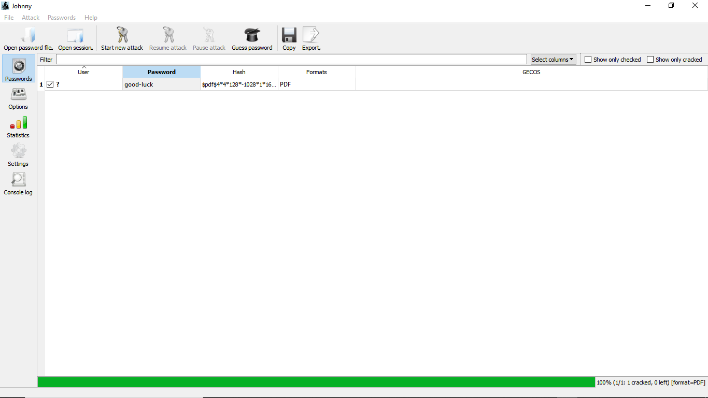
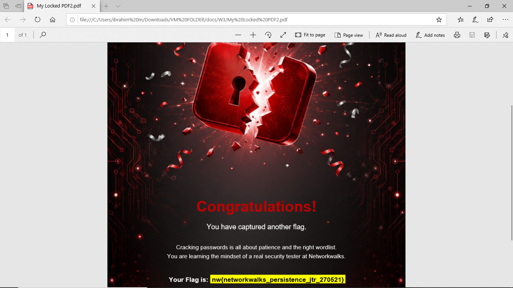

# **password-cracking**
Week 3 / Cyber Security / BO83 / NETWORKWALKS ACADEMY

**Password Cracking Using NetworkWalks Tools and John The Ripper (JTR)**

### **Aims and Objectives**

The aim of this task is to learn how to crack passwords using various password cracking tools, understanding the methods and processes involved in recovering passwords from hashed or protected data.

### **Tools Required**

**John The Ripper (JTR)**
- Online Hash Generator/Extractor — used to generate or extract password hashes for testing
- John The Ripper (JTR) — preferably the GUI-based version, used to crack the generated hashes

**NetworkWalks Tool**
- Hash Checker/Generator (link) — online tool used to generate or verify the password hash
- Password Cracker (link) — online tool used to crack the generated hash
### **Task/Procedure**

**John The Ripper (JTR)**

1. Download John The Ripper from their official website: https://www.openwall.com/john
2. Download Johnny GUI from the same site.
3. Extract and run the setup file.
4. Open the app, click **Settings**, and select the path to the John application (john.exe).
5. Upload your PDF file to the online hash checker: [https://www.onlinehashcrack.com/tools-pdf-hash-extractor.php](https://www.onlinehashcrack.com/tools-pdf-hash-extractor.php)
6. Copy the generated hash and save it to a notepad file. Return to the Johnny app, click **Open Password File**, and select the saved hash file.
7. Click **Start Attack** — the password will be generated. Speed depends on your PC's CPU strength, so it may be fast or slow. Once generated, copy the password and use it to unlock the file.

**Problems Encountered**

While setting up Johnny GUI, the app kept opening multiple tabs (over 100) and freezing my system. This was caused by an incorrect path configuration — it was pointing to `johnny.exe` instead of the correct John executable.

**Faulty path:**
`PathToJohn=C:/Program Files (x86)/Johnny/johnny.exe`

**Fix — corrected path:**
`C:\Users\ibrahim m\Downloads\...\run\john.exe`

After updating the path in Johnny's settings to point directly to `john.exe` (John the Ripper 1.9.0-jumbo-1), the issue was resolved and the app ran normally.

**NetworkWalks Tool**

1. Open the NetworkWalks Hash Calculator in your web browser: [https://networkwalks.com/hash-calculator/](https://networkwalks.com/hash-calculator/)
2. Choose the file option and upload your file, then start cracking. The hash must start with `$pdf$`.
3. Copy the hash and open the NetworkWalks Password Cracker in your web browser: [https://networkwalks.com/password-cracker/](https://networkwalks.com/password-cracker/), then click **Start Cracking**.
4. Once the password is displayed, copy and use it to open the file

**Problems**

No problems were encountered, but if no password is found, upload another wordlist — this should resolve the issue.

### **Conclusion**

This task provided hands-on experience with password cracking using two different approaches: John The Ripper (JTR), a locally installed GUI-based tool, and NetworkWalks, a fully online tool. Working through both methods highlighted the differences between offline and online password recovery workflows, from hash extraction to running the actual cracking attack.

A key part of the learning process came from troubleshooting the path configuration issue encountered with Johnny GUI, which reinforced the importance of correctly configuring tool settings before running an attack. Overall, this exercise deepened my understanding of how password hashes are generated, extracted, and cracked, and strengthened my practical skills with cybersecurity tools relevant to password security testing.

### **Author**

**mumbelsec**

W3 / Cyber Security / NetworkWalks

Cyber Security Professional

🔗 **LinkedIn Post:** [Week 3 – Password Cracking Using NetworkWalks Tools and John The Ripper](https://www.linkedin.com/pulse/week-3-password-cracking-using-networkwalks-tools-john-muhammad-aeyif)
